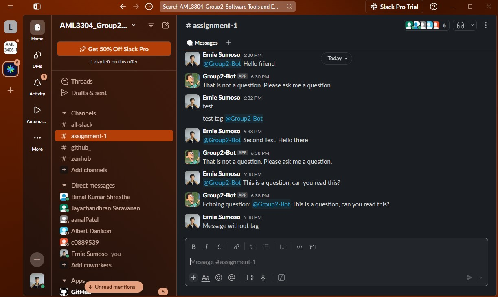

<a name="readme-top"></a>

<!-- PROJECT LOGO -->
<br />
<div align="center">
  <a href="https://github.com/ErnieSumoso/AML3304_Group2">
    
  </a>

  <h3 align="center">Slack Bot</h3>
    This is a repository for the development of a Slack Chatbot, designed primarily to detect and echo user queries within a Slack workspace.
  <p align="center">
    <br />
    <a href="https://github.com/github_username/repo_name/issues/new?labels=bug&template=bug-report---.md">Report Issue</a>
    ·
    <a href="https://github.com/github_username/repo_name/issues/new?labels=enhancement&template=feature-request---.md">Request Feature</a>
  </p>
</div>


## About The Project

<div align="center">
  
</div>
This repository contains the code and documentation for the development and deployment of a simple Slack Bot.
The project utilizes the Slack API and Ngrok for deployment.
<p align="right">(<a href="#readme-top">back to top</a>)</p>


### Built With

* [![Python][python-badge]][python-url]
* [![Flask][flask-badge]][flask-url]
* [![Slack][slack-badge]][slack-url]
* [![Ngrok][ngrok-badge]][ngrok-url]

<p align="right">(<a href="#readme-top">back to top</a>)</p>


## Getting Started

### Prerequisites

To start the installation you need to have Python installed on your computer:
* [Python 3+](https://www.python.org/downloads/)

You need to create an application in your Slack API
* [Slack API](api.slack.com)

Give the following permissions to your Slack App:
- channels:history
- channels:read
- chat:write

And install the app on the desired Slack channels on your workspace.

Finally, Ngrok authentication is required. You can create an account in the following site to get a token.
* [Ngrok](https://dashboard.ngrok.com/get-started/your-authtoken)

### Installation

1. Clone the repo
   ```sh
   git clone https://github.com/ErnieSumoso/AML3304_Group2.git
   ```
2. Create a python virtual environment
   ```sh
   python -m venv /path/to/new/virtual/environment
   ```
3. Activate the virtual environemnt
   ```sh
   /path/to/new/virtual/environment/Scripts/Activate
   ```
4. Download the requirements
   ```sh
   pip install -r requirements.txt
   ```
5. Set env variables SLACK_TOKEN and SIGNING_SECRET, from your Slack API
6. Run the project
   ```sh
   python slack-bot.py
   ```
7. Open the Ngrok file and authenticate using your Ngrok Token:
   ```sh
   ngrok config add-authtoken [NGROK TOKEN]
   ```
8. Port your local deployment using Ngrok
   ```sh
   ngrok http [PORT TO DEPLOY]
   ```
9. Activate event subscriptions in your Slack API
10. Copy and paste the free URL provided by Ngrok CMD into the Slack API event subscription
11. Reinstall your app into the channels on your Slack workspace
12. Enjoy!

<p align="right">(<a href="#readme-top">back to top</a>)</p>

## Usage

You can use this repository to create an initial template for a Slack bot yourself!

<p align="right">(<a href="#readme-top">back to top</a>)</p>


## Roadmap

- [X] Bot is able to detect user queries
- [X] Bot responds only when it is tagged
- [X] Bot echoes user queries

We are always open for any suggestions on what feature to implement next. Please, add them on the [issues section](https://github.com/ErnieSumoso/AML3304_Group2/issues).

<p align="right">(<a href="#readme-top">back to top</a>)</p>

<!-- MARKDOWN LINKS & IMAGES -->
<!-- https://www.markdownguide.org/basic-syntax/#reference-style-links -->
[python-badge]: https://img.shields.io/badge/python-3670A0?style=for-the-badge&logo=python&logoColor=ffdd54
[python-url]: https://www.python.org/
[flask-badge]: https://img.shields.io/badge/Flask-000000?style=for-the-badge&logo=Flask&logoColor=white
[flask-url]: https://flask.palletsprojects.com/en/3.0.x/
[ngrok-badge]: https://img.shields.io/badge/ngrok-1F1E37?logo=ngrok&logoColor=fff&style=for-the-badge
[ngrok-url]: https://ngrok.com/
[slack-badge]: https://img.shields.io/badge/Slack-4A154B?logo=slack&logoColor=fff&style=for-the-badge
[slack-url]: https://api.slack.com/
