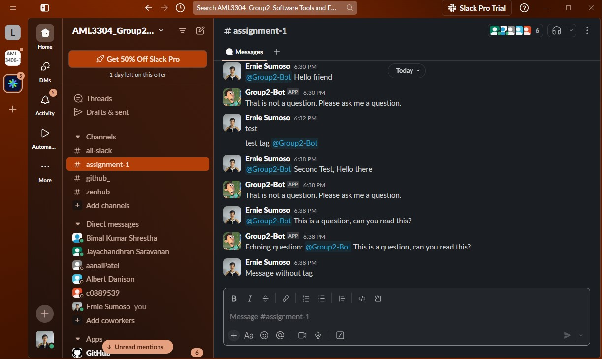

<a name="readme-top"></a>

<!-- PROJECT LOGO -->
<br />
<div align="center">
    

  <h3 align="center">Slack Bot</h3>
  <b>### Final version - no additional updates planned ###</b> <br><br>
    This repository contains the development of a Slack Chatbot using Python, designed to detect and respond to user queries within a Slack workspace.
    The bot is programmed to respond only when directly mentioned, ensuring non-intrusive interactions.
  <p align="center">
    <br />
    <a href="https://github.com/ErnieSumoso/slack-chatbot/pulls">Pull Requests</a>
    ·
    <a href="https://github.com/ErnieSumoso/slack-chatbot/issues">Issues</a>
  </p>
</div>


## About The Project

<div align="center">
  
</div>
The project uses the Slack API for message handling and Ngrok for exposing the local server to the internet, allowing real-time testing and deployment.
The repository includes all source code and documentation required for setup and customization. Some of the chatbot current features include: detecting user queries in Slack channels,
replying only when tagged (using @botname), echoing user queries back to the channel.
<p align="right">(<a href="#readme-top">back to top</a>)</p>


### Built With

* [![Python][python-badge]][python-url]
* [![Flask][flask-badge]][flask-url]
* [![Slack][slack-badge]][slack-url]
* [![Ngrok][ngrok-badge]][ngrok-url]

<p align="right">(<a href="#readme-top">back to top</a>)</p>


## Getting Started

### Prerequisites

1. To start the installation you need [Python 3+](https://www.python.org/downloads/) installed.

2. You need to create an application in your [Slack API](api.slack.com).

3. Give the following permissions to your Slack App:
    - channels:history
    - channels:read
    - chat:write

4. Install the app on the desired Slack channels within your workspace.

5. Finally, Ngrok authentication is required. You can create an account in the following site to get a token.
    - [Ngrok](https://dashboard.ngrok.com/get-started/your-authtoken)

### Installation

1. Clone the repo
   ```sh
   git clone https://github.com/ErnieSumoso/AML3304_Group2.git
   ```
2. Create a python virtual environment
   ```sh
   python -m venv /path/to/new/virtual/environment
   ```
3. Activate the virtual environemnt
   ```sh
   /path/to/new/virtual/environment/Scripts/Activate
   ```
4. Download the requirements
   ```sh
   pip install -r requirements.txt
   ```
5. Set env variables SLACK_TOKEN and SIGNING_SECRET, from your Slack API
6. Run the project
   ```sh
   python src/slack-bot.py
   ```
7. Open the Ngrok file and authenticate using your Ngrok Token:
   ```sh
   ngrok config add-authtoken [NGROK TOKEN]
   ```
8. Port your local deployment using Ngrok
   ```sh
   ngrok http [PORT TO DEPLOY]
   ```
9. Activate event subscriptions on your Slack API.
10. Copy and paste the free URL provided by Ngrok CMD into the Slack API event subscription.
11. Finally, reinstall your Slack API application into your channels on your Slack workspace.

<p align="right">(<a href="#readme-top">back to top</a>)</p>

## Usage

You can use this repository as a starting point to build your own Slack bot using Python.
It provides a basic template with core features like detecting and responding to user messages when tagged.

<p align="right">(<a href="#readme-top">back to top</a>)</p>


## Roadmap

- [X] The bot can detect user queries within Slack channels.
- [X] The bot responds only when it is directly tagged.
- [X] the bot echoes user’s queries back to the channel.

I am always open for suggestions and new features to implement next. Please, add them on the [issues section](https://github.com/ErnieSumoso/slack-chatbot/issues).

<p align="right">(<a href="#readme-top">back to top</a>)</p>

<!-- CONTACT -->
## Contact
Ernie Sumoso - [GitHub Profile](https://github.com/ErnieSumoso) - [My Repositories](https://github.com/ErnieSumoso?tab=repositories)
<!-- MARKDOWN LINKS & IMAGES -->
<!-- https://www.markdownguide.org/basic-syntax/#reference-style-links -->
[python-badge]: https://img.shields.io/badge/python-3670A0?style=for-the-badge&logo=python&logoColor=ffdd54
[python-url]: https://www.python.org/
[flask-badge]: https://img.shields.io/badge/Flask-000000?style=for-the-badge&logo=Flask&logoColor=white
[flask-url]: https://flask.palletsprojects.com/en/3.0.x/
[ngrok-badge]: https://img.shields.io/badge/ngrok-1F1E37?logo=ngrok&logoColor=fff&style=for-the-badge
[ngrok-url]: https://ngrok.com/
[slack-badge]: https://img.shields.io/badge/Slack-4A154B?logo=slack&logoColor=fff&style=for-the-badge
[slack-url]: https://api.slack.com/
